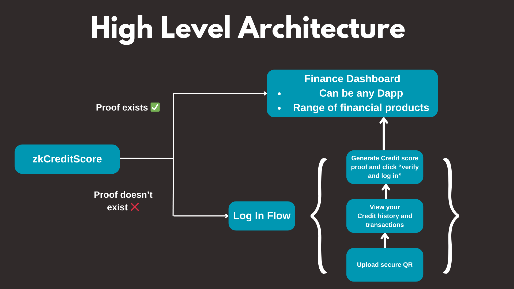
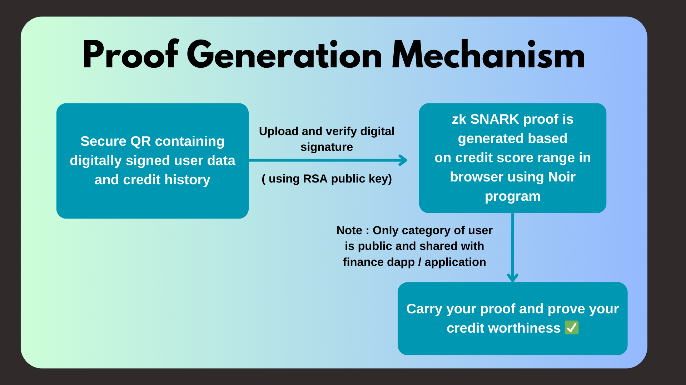

# zkCreditScore

Prove your credit worthiness using zk proofs

## Links

- [Deployed URL]()
- [Git Repo with README]()

## Protocol Specs

- Noir for writing down Snarks based zk proof generation
- jsqr for reading the qr data
-

## System Architecture

  

## Instructions to setup

Follow these simple steps to work on your own machine:

1. Install [yarn](https://yarnpkg.com/) (tested on yarn v1.22.19)

2. Install [Node.js >20.10 (latest LTS)](https://nodejs.org/en) (tested on v18.17.0)

3. Install [noirup](https://noir-lang.org/getting_started/nargo_installation/#option-1-noirup) with

   ```bash
   curl -L https://raw.githubusercontent.com/noir-lang/noirup/main/install | bash
   ```

4. Install Nargo with

   ```bash
   noirup
   ```

5. Install dependencies with

   ```bash
   yarn
   ```

## App Demo

  
  


## Tech Stack

- Vite
- Hardhat
- Noir
- Typescript
- jsqr
- Tailwind CSS
- Radix UI
- Connectkit
- wagmi
- view
- react-toastify
- crypto-browserify
