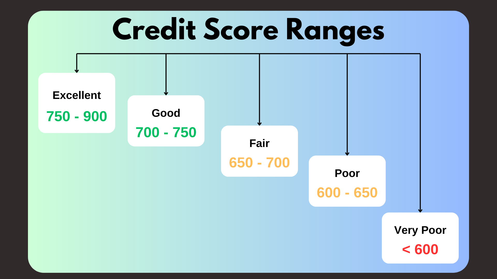
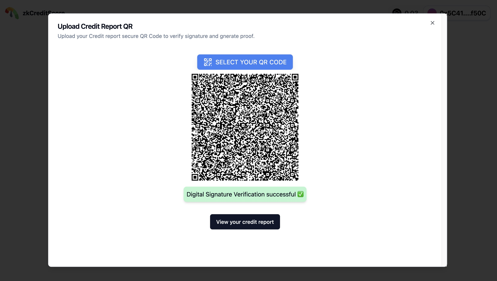
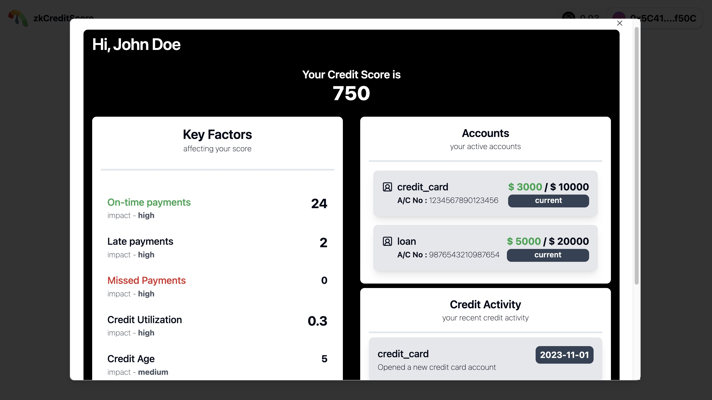
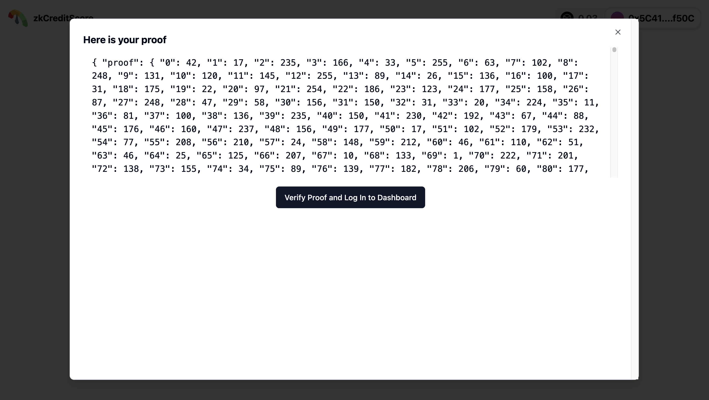
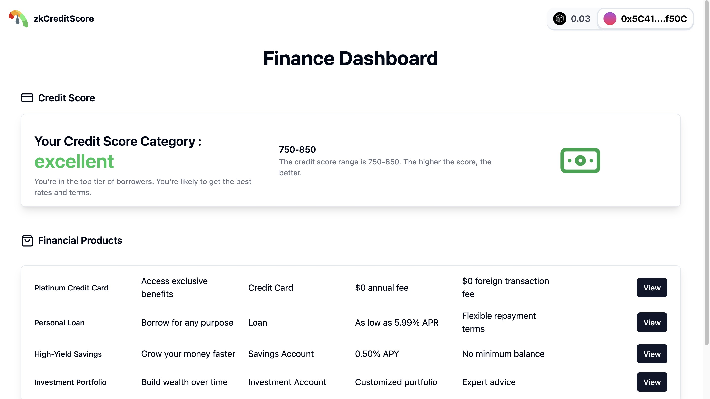

# zkCreditScore

Prove your credit worthiness using zk proofs.

[](https://zk-credit-score.vercel.app/)

## Usage Instructions

- Go to the deployed [URL]()
- Get a sample QR code from the following user types:
  - [Excellent Credit Score](./data//user_1_qr.png)
  - [Good Credit Score User](./data/user_2_qr.png)
  - [Fair Credit Score User](./data/user_3_qr.png)
  - [Poor Credit Score User](./data/user_4_qr.png)
  - [Very Poor Credit Score User](./data/user_5_qr.png)
  - [Tampered QR Code](./data//user_1_qr_tampered.png) (to check digital signature verification
    failure)
- Click on Login and Upload QR to view the credit history and recent transactions along with user's
  credit score.
- Generate credit score proof and click on "Verify and Log in" to enter finance dashboard.

## System Architecture

  

## Instructions to setup locally

Follow these simple steps to run this project on your own machine:

1. Install [yarn](https://yarnpkg.com/) (tested on yarn v1.22.19)

2. Install [Node.js >20.10 (latest LTS)](https://nodejs.org/en) (tested on v18.17.0)

3. Install [noirup](https://noir-lang.org/getting_started/nargo_installation/#option-1-noirup) with

   ```bash
   curl -L https://raw.githubusercontent.com/noir-lang/noirup/main/install | bash
   ```

4. Install Nargo with

   ```bash
   noirup
   ```

5. Install dependencies with

   ```bash
   yarn
   ```

## App Demo Screenshots






## Tech Stack

- Vite
- Hardhat
- Noir
- Typescript
- jsqr
- Tailwind CSS
- Radix UI
- Connectkit
- wagmi
- view
- react-toastify
- crypto-browserify

## Team

Team [AlphaDevs](https://alphadevs.dev) 👇

### Github

[Harsh Tyagi](https://github.com/mr-harshtyagi) [Yashasvi Chaudhary](https://github.com/0xyshv)

### Twitter / X

[Harsh Tyagi](https://twitter.com/mr_harshtyagi) [Yashasvi Chaudhary](https://twitter.com/0xyshv)

## Thanks

Feel free to reach out to the [AlphaDevs team](https://alphadevs.dev) with any questions or issues.
